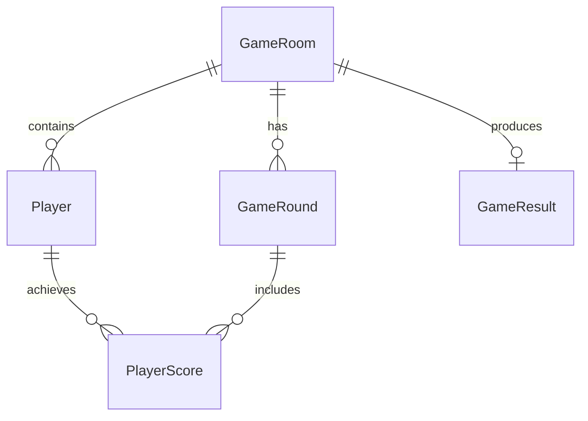

# Data Model: 數字抽籤遊戲

**Created**: 2026-01-12  
**Feature**: [spec.md](./spec.md) | [plan.md](./plan.md)

## 核心實體

### GameRoom (遊戲房間)
```javascript
{
  roomCode: string,           // 4-6位數字房間代碼
  currentRound: number,       // 當前輪數 (1-5)
  gameState: GameState,       // 遊戲狀態枚舉
  hostTargetNumber: number,   // 主持人目標數字 (0-100)
  maxPlayers: number,         // 最大參賽者數量 (固定為5)
  createdAt: Date,           // 房間建立時間
  updatedAt: Date            // 最後更新時間
}

enum GameState {
  WAITING = "waiting",           // 等待參賽者加入
  LOTTERY_IN_PROGRESS = "lottery_in_progress",  // 抽籤進行中
  SCORING = "scoring",           // 計分階段
  ROUND_COMPLETE = "round_complete",  // 本輪完成
  GAME_FINISHED = "game_finished"     // 遊戲結束
}
```

### Player (參賽者)
```javascript
{
  playerId: string,           // 唯一識別碼 (UUID)
  nickname: string,           // 參賽者暱稱
  roomCode: string,           // 所屬房間代碼
  currentNumber: number,      // 當前抽中數字 (0-100, null if not drawn)
  totalScore: number,         // 累計總得分
  connectionStatus: ConnectionStatus,  // 連線狀態
  position: number,           // 顯示位置 (1-5)
  joinedAt: Date             // 加入時間
}

enum ConnectionStatus {
  ONLINE = "online",          // 線上
  OFFLINE = "offline",        // 離線
  RECONNECTING = "reconnecting"  // 重新連線中
}
```

### GameRound (遊戲輪次)
```javascript
{
  roundId: string,            // 輪次唯一識別碼
  roomCode: string,           // 所屬房間代碼
  roundNumber: number,        // 輪數 (1-5)
  hostTargetNumber: number,   // 主持人目標數字
  playerScores: PlayerScore[], // 所有參賽者該輪得分
  isComplete: boolean,        // 是否完成
  completedAt: Date          // 完成時間
}

type PlayerScore = {
  playerId: string,           // 參賽者ID
  drawnNumber: number,        // 抽中數字
  score: number,              // 該輪得分 (drawnNumber - hostTargetNumber)
  drawnAt: Date              // 抽籤時間
}
```

### GameResult (遊戲結果)
```javascript
{
  resultId: string,           // 結果唯一識別碼
  roomCode: string,           // 所屬房間代碼
  winners: string[],          // 獲勝者ID列表 (可多人並列)
  finalRankings: PlayerRanking[], // 最終排名
  gameCompletedAt: Date,      // 遊戲完成時間
  totalRounds: number         // 總輪數 (固定為5)
}

type PlayerRanking = {
  playerId: string,           // 參賽者ID
  nickname: string,           // 暱稱
  totalScore: number,         // 總得分
  rank: number,               // 排名
  roundScores: number[]       // 各輪得分記錄
}
```

## 數據驗證規則

### GameRoom 驗證
- `roomCode`: 4-6位數字，必須唯一
- `currentRound`: 1-5 之間的整數
- `hostTargetNumber`: 0-100 之間的整數，允許 null
- `gameState`: 必須為有效的 GameState 枚舉值

### Player 驗證
- `playerId`: 必須為有效的 UUID 格式
- `nickname`: 1-20個字元，不可包含特殊符號
- `currentNumber`: 0-100 之間的整數，允許 null
- `position`: 1-5 之間的整數，同房間內必須唯一

### GameRound 驗證
- `roundNumber`: 1-5 之間的整數
- `hostTargetNumber`: 0-100 之間的整數
- `playerScores`: 每個房間每輪最多5筆記錄
- `score`: drawnNumber - hostTargetNumber 的計算結果

## 狀態轉換規則

### 遊戲狀態轉換
```
WAITING → LOTTERY_IN_PROGRESS  // 主持人啟動抽籤
LOTTERY_IN_PROGRESS → SCORING  // 所有參賽者完成抽籤
SCORING → ROUND_COMPLETE      // 計分完成
ROUND_COMPLETE → LOTTERY_IN_PROGRESS  // 開始下一輪 (未達5輪)
ROUND_COMPLETE → GAME_FINISHED       // 完成第5輪
```

### 連線狀態轉換
```
ONLINE → OFFLINE              // 網路中斷
OFFLINE → RECONNECTING        // 嘗試重新連線
RECONNECTING → ONLINE         // 重新連線成功
RECONNECTING → OFFLINE        // 重新連線失敗
```

## 數據關聯



## 儲存策略

### LocalStorage (即時數據)
- 當前房間狀態 (`gameRoom`)
- 當前參賽者列表 (`players`)
- 當前輪次數據 (`currentRound`)

### IndexedDB (持久化數據)
- 完整遊戲記錄 (`gameHistory`)
- 參賽者歷史表現 (`playerHistory`)
- 錯誤日誌 (`errorLogs`)

### 數據同步規則
1. 所有狀態變更先寫入 LocalStorage
2. 輪次完成後寫入 IndexedDB
3. WebRTC 同步失敗時使用 LocalStorage 作為真相來源
4. 遊戲結束後選擇性清理 LocalStorage